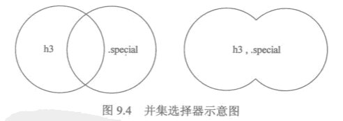

<!--
                 file : css.md
        creation date : 27-03-2017 19:31
           created by : Hubert Li
        last modified : 2017年04月 4日 23:33:12
            copyright : 2015-2019 by Hubert Li
                             Strictly Confidential
                             All rights reserved.
                       No part of this hardware description, either
                       material or conceptual may be copied or distributed,
                       transmitted, transcribed, stored in a retrieval system
                       or translated into any human or computer language in
                       any form by any means, electronic, mechanical, manual
                       or otherwise, or disclosed to third parties without
                       the express written permission of Hubert Li
-->


# 三、css
------------

## 1.基本概念
* 层叠样式表 CSS
   * 用于控制网页样式并允许将样式信息与网页内容分离的一种标记性语言

   * 一组格式化指令，格式化指令被称为样式规则，能够同时控制众多HTML页面的外观
   * 样式规则，包括一个或多个样式属性及其值 
   * 指定
      * 字体
      * 字间距
      * 行间距
      * 页面边距
      * 边框
      * 颜色
      * 背景
   * 可以直接存储与HTML网页或者单数的样式单文件
* 样式规则
   * 样式规则 以 “层叠”的方式，应用与HTML文档
      * 更具体的样式覆盖通用样式

* css样式组成
   * css样式由3个基本部分组成
      * 对象
      * 属性
      * 值
   * 格式
   ```
      对象{
         属性1:值1;
         属性2:值2;
         ...
      }
   ```
* css注释
   * 注释
   ```
      /* 单行注释 */
      /* 多行注释 行1
         行2(中间不能有有效代码)      */
   ```
   * style
     * 在```<style></style>```中，会用```<!--```和 ```-->```将所有的CSS代码包含在内
     * 为了避免老式浏览器不支持

## 2. css对象-css选择器
* css对象
   * 指定对哪些网页进行设置
   * 专门名称，选择器
* 选择器
   * 分基本选择器和复合选择器
* 基本选择器
   * 标记选择器/类别选择器/ID选择器
* 复合选择器
   * 通过对基本选择器进行组合而构成的

### 基本选择器

#### 标记选择器
* 对象是HTML标记/标签
* 选择器作用是声明哪些标记采用哪些css样式
* 格式

* 使用
   * html文本中引用该标记选择器
   * html文本文件中，对应HTML标记/标签会按照css标记选择器显示

#### 类别选择器
* 对象是类别值(class值)
* 格式

* 使用
   * html文本中引用该类型选择器
   * html标记增加类别属性 class="定义的类别class值"
* 类别选择器和标记选择器可以同时使用
   * 类别选择器具有较高优先级
   * 没有引用类别选择器的HTML标记使用标记选择器

#### ID选择器
* ID选择器只能在HTML页面中使用一次
   * JaveScript灯脚本语言也可以调用，为了防止一ID两用，一个ID只被使用一次
* 对象是ID名
* 格式

* 使用
   * html文本中引用该ID选择器
   * html标记增加ID属性 id="定义的ID名"

### 复合选择器
* 复合选择器就是两个或多个基本选择器，通过不同方式连接而成的选择器

#### "交集"选择器
* 由两个选择器直接连接构成
   * 选择器将选中同时满足2个选择器定义的元素
   * 第一个基本选择器必须是，标记选择器
   * 第二个基本选个器必须是，类别选择器或者ID选择器
* 格式
   * 两个选择器名称直接连接

* 使用
   * HTML标记中同时包含两种选择器，才会生效

#### "并集"选择器
* 并集选择器，集体声明
   * 同时选中各个基本选择器所选择的范围
   * 任何形式的选择器都可以作为并集选择器的一部分
* 格式
   * 选择器通过逗号连接

* 使用
   * 多个选择器的同时声明，具有相同的属性和属性值
   * 多个选择器的并集使用，在HTML标记中并集引用多个选择器

#### 后代选择器
* 外层，内层
   * HTML可以镶嵌使用，外面的标记叫做外层标记，里面的标记叫做内层标记
* 基本选择器
   * 任何基本选择器都可以进行嵌套
* 格式
   * 外层标记写在前面，内层标记写在后面，中间用空格进行分隔
* 后代
   * 当标记发生嵌套时，内层的标记成为外层标记的后代
* 使用
   * 最外层标记，用class或者id标记，内层的直接用后代选择器定义，不需要专用的class或id
* 注意
   * 后代可以有各级后代
   * 后代选择器不仅限于直接后代，而且会影响它的各级后代

#### 子选择器
* 类似于后代选择器,但只对直接后代有影响，对子孙后代不产生影响。
* 格式
   * 外层标记写在前面，内层标记写在后面，中间用```>```进行分隔


## 3. 在HTML中使用CSS的方法
* 包括 行内样式、内嵌式、链接式、导入式
* HTML ```<style></style>```标记中可以导入多个样式表
* CSS文件中也可以导入其他的样式表

### 行内样式
* 直接在HTML标记/标签中增加style属性
* 语法
```
   <HTML标记 style="属性1:值1; 属性2:值2; ...">
```
* 优点
* 缺点
   * 需要为每一个HTML标记设置style属性
   * 网页臃肿
   * 后期维护成本高
   * 不推荐使用

### 内嵌式
* 将CSS样式表写在```<head></head>```之间
* 使用```<style></style>```标记/标签进行声明
* 语法
```
<head>
   <style type="text/css">
      css样式表1
      ...
      css样式表n
   </style>
</head>
```
* 优点
* 缺点
   * 对拥有很多网页的网站，不同的网页需要同样的样式，该方法不适以
   * 适用于对特殊页面设置单独的样式风格

### 链接式
* 写在```<head></head>```之间,使用```<link>```标记/标签进行css文件链接到页面
* 在HTML的标记需要CSS样式时，才以链接的方式引入，不同于导入式
* 语法
```
<head>
   <link href="url(css)" type="text/css" rel="stylesheet">
</head>
```
* 优点
   * 完全实现HTML结构和CSS表现样式的分离
   * 同一个css文件可以链接到多个HTML文件中，使网站的风格统一、协调
   * 方便前期设计和后期维护

### 导入式
* 在HTML文件的初始化时，CSS文件会被导入到HTML文件中，作为文件的一部分，类似于内嵌式的效果,不同于链接式
* 写在```<head> <style></style> </head>```之间,使用```@import 语句```将css文件导入到页面
* 语法
```
<head>
   <style type="text/css">
      @import url(xxx.css);
      @import url("xxx.css");
      @import url('xxx.css');
      @import xxx.css;
      @import "xxx.css";
      @import 'xxx.css';
   </style>
</head>
```

### 方法的优先级
* 行内式 优先于```<head></head>```中的css样式
* ```<head></head>```中
   * 在同一```<style> </style>```标记中的多种方法
      * 不同属性，同时生效
      * 同一属性
         * 嵌入式 > 导入式
   * 多个```<style></style>```标记，和链接式之间
      * 不同属性，同时生效
      * 同一属性
         * 在文件中的先后顺序决定，最后面的由最高的优先级

## 4.CSS的继承性 与 层叠性

### 继承性
* HTML标记各级包含，子标记会继承父标记的风格样式
* 子标记会继承父标记的所有样式风格，而子标记的样式风格完全不会影响父标记
* 如果父标记和子标记有相同的属性，子标记的属性具有优先级

### 层叠性
* 层叠不同于继承性，可以简单地理解为继承过程中“冲突”的解决方案


## 2.语法
* 每个样式规则都以";"分号计数

### 使用CSS样式单
* HTML文档链接样式单
   * 在文档```<head> </head>```部分包含一个```<link/>```标签
   * 举例
   ```
      <link rel = "stylesheet" type="text/css" href="/folder/styles.css"/>
   ```

### 样式属性
* 用于控制字体/颜色/对齐方式/边距
* 分为2大类
   * 布局属性
      * 由影响网页中元素位置的属性(边距/填充/对齐等)组成
   * 格式化属性
      * 由影响网页中元素的视觉显示的属性(字体类型/大小/颜色等)组成
* 格式
   * 属性:值

#### 布局属性
* 决定内容在网页上如何排列

##### 1. display 属性
* 有4个可能的取值
   * block
      * 元素显示在下一行，作为一个新段落
   * list-item
      * 元素显示在下一行，前面有列表元素标记(项目符号)
   * inline
      * 元素显示在当前段落内
   * none
      * 元素隐藏不显示
* display 依赖于相对位置的概念
   * 相对位置，指元素相对于网页中其他元素进行定位
   * 绝对位置，将元素放在网页中特定的位置，而不考虑其他元素

##### 2.width/height 属性
* 控制元素矩形区域的大小
* 值可使用不同的度量单位
   * in(英寸)
   * cm(厘米)
   * mm(毫米)
   * px(像素)
   * pt(点)
* 在同一个样式单中，可以使用不同的度量单位，但类似的样式属性最好使用一致的单位

#### 格式化属性
* 用于控制网页内容的外观

##### 1. border属性
* 用于在元素四周建立一个可见的方框或部分边框
* 有下列具体的属性
   * border-width : 边框的宽度
   * border-color : 边框的颜色
   * border-style : 边框的样式
      * 值/含义
         * solid  : 单实线
         * double : 双实线
         * dashed : 虚线
         * dotted : 点线
         * groove : 沟线
         * ridge  : 脊线
         * inset  : 内陷边框
         * outset : 外凸边框
         * none   : 无边框
      * 默认值:none
         * 例外，图像放在```<a>```标签内最为链接图像时，默认实线边框
   * border-left  : 边框的左边
   * border-right : 边框的右边
   * border-top   : 边框的顶部
   * border-bottom: 边框的底部
   * border       : 边框的所有边
      * 值：border-width border-style border-color

##### 2. color / background-color 属性
* color 设置元素中文本的颜色(前景色)
* background-color 设置文本后面的背景色
* 值：
   * 预定义的颜色
      * black / orange / gray / silver(浅灰) / green / purple（紫色) / yellow / red / white 
   * 自定义颜色
      * 通过制定十六进制或RGB(红、绿、蓝)十进制值
      * 十六进制 
      ```
         #xxxxxx   , x->[0,f]
      ```
      * rgb(x,x,x), x->[0,255]
      
##### 3. text-align(对齐)
* 值
   * left   : 向左对齐
   * right  : 向右对齐
   * center : 向中对齐

##### 4.text-indent(缩进)属性
* 

##### 5. font 字体属性
* font-family  : 字体集
   * 制定一个有优先级的字体集合名称列表，而不是一个值
* font-size    : 字体大小
   * in(英寸)
   * cm(厘米)
   * mm(毫米)
   * px(像素)
   * pt(点)
   * 通常使用pot 
* font-style   : 字体样式(正常或斜体等)
   * italic
* font-weight  : 字体的粗细(细、中等、粗等)
   * bold
   * medium
* font
   * 一次指定许多字体属性

##### 6. line-height 文本行高度
* 通常以点为单位

##### 7. text-decoration 链接下划线
* 值
   * underline
   * italic
   * line-through
   * none
      * 用于删除链接的下划线

##### 8. padding 内边距
* 在元素的左/右/上/下添加填充(内边距)
* 填充的单位可以为页宽的百分比
* padding-top     : 上填充
* padding-bottom  : 下填充
* padding-left    : 左填充
* padding-right   : 右填充


### 样式类
* 一组自定义的格式化说明


