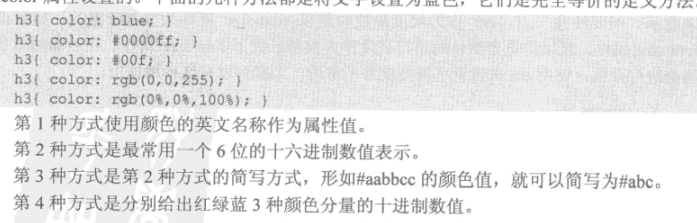
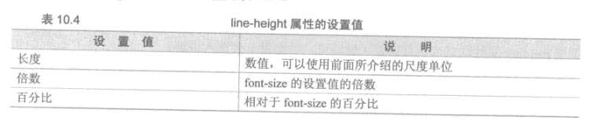

<!--
                 file : css.md
        creation date : 27-03-2017 19:31
           created by : Hubert Li
        last modified : 2017年04月11日 21:29:18
            copyright : 2015-2019 by Hubert Li
                             Strictly Confidential
                             All rights reserved.
                       No part of this hardware description, either
                       material or conceptual may be copied or distributed,
                       transmitted, transcribed, stored in a retrieval system
                       or translated into any human or computer language in
                       any form by any means, electronic, mechanical, manual
                       or otherwise, or disclosed to third parties without
                       the express written permission of Hubert Li
-->


# 三、css
------------

## 1.基本概念
* 层叠样式表 CSS
   * 用于控制网页样式并允许将样式信息与网页内容分离的一种标记性语言

   * 一组格式化指令，格式化指令被称为样式规则，能够同时控制众多HTML页面的外观
   * 样式规则，包括一个或多个样式属性及其值 
   * 指定
      * 字体
      * 字间距
      * 行间距
      * 页面边距
      * 边框
      * 颜色
      * 背景
   * 可以直接存储与HTML网页或者单数的样式单文件
* 样式规则
   * 样式规则 以 “层叠”的方式，应用与HTML文档
      * 更具体的样式覆盖通用样式

* css样式组成
   * css样式由3个基本部分组成
      * 对象
      * 属性
      * 值
   * 格式
   ```
      对象{
         属性1:值1;
         属性2:值2;
         ...
      }
   ```
* css注释
   * 注释
   ```
      /* 单行注释 */
      /* 多行注释 行1
         行2(中间不能有有效代码)      */
   ```
   * style
     * 在```<style></style>```中，会用```<!--```和 ```-->```将所有的CSS代码包含在内
     * 为了避免老式浏览器不支持

## 2. css对象-css选择器
* css对象
   * 指定对哪些网页进行设置
   * 专门名称，选择器
* 选择器
   * 分基本选择器和复合选择器
* 基本选择器
   * 标记选择器/类别选择器/ID选择器
* 复合选择器
   * 通过对基本选择器进行组合而构成的

### 基本选择器

#### 标记选择器
* 对象是HTML标记/标签
* 选择器作用是声明哪些标记采用哪些css样式
* 格式

* 使用
   * html文本中引用该标记选择器
   * html文本文件中，对应HTML标记/标签会按照css标记选择器显示

#### 类别选择器
* 对象是类别值(class值)
* 格式

* 使用
   * html文本中引用该类型选择器
   * html标记增加类别属性 class="定义的类别class值"
* 类别选择器和标记选择器可以同时使用
   * 类别选择器具有较高优先级
   * 没有引用类别选择器的HTML标记使用标记选择器

#### ID选择器
* ID选择器只能在HTML页面中使用一次
   * JaveScript灯脚本语言也可以调用，为了防止一ID两用，一个ID只被使用一次
* 对象是ID名
* 格式

* 使用
   * html文本中引用该ID选择器
   * html标记增加ID属性 id="定义的ID名"

### 复合选择器
* 复合选择器就是两个或多个基本选择器，通过不同方式连接而成的选择器

#### "交集"选择器
* 由两个选择器直接连接构成
   * 选择器将选中同时满足2个选择器定义的元素
   * 第一个基本选择器必须是，标记选择器
   * 第二个基本选个器必须是，类别选择器或者ID选择器
* 格式
   * 两个选择器名称直接连接

* 使用
   * HTML标记中同时包含两种选择器，才会生效

#### "并集"选择器
* 并集选择器，集体声明
   * 同时选中各个基本选择器所选择的范围
   * 任何形式的选择器都可以作为并集选择器的一部分
* 格式
   * 选择器通过逗号连接

* 使用
   * 多个选择器的同时声明，具有相同的属性和属性值
   * 多个选择器的并集使用，在HTML标记中并集引用多个选择器

#### 后代选择器
* 外层，内层
   * HTML可以镶嵌使用，外面的标记叫做外层标记，里面的标记叫做内层标记
* 基本选择器
   * 任何基本选择器都可以进行嵌套
* 格式
   * 外层标记写在前面，内层标记写在后面，中间用空格进行分隔
* 后代
   * 当标记发生嵌套时，内层的标记成为外层标记的后代
* 使用
   * 最外层标记，用class或者id标记，内层的直接用后代选择器定义，不需要专用的class或id
* 注意
   * 后代可以有各级后代
   * 后代选择器不仅限于直接后代，而且会影响它的各级后代

#### 子选择器
* 类似于后代选择器,但只对直接后代有影响，对子孙后代不产生影响。
* 格式
   * 外层标记写在前面，内层标记写在后面，中间用```>```进行分隔


## 3. 在HTML中使用CSS的方法
* 包括 行内样式、内嵌式、链接式、导入式
* HTML ```<style></style>```标记中可以导入多个样式表
* CSS文件中也可以导入其他的样式表

### 行内样式
* 直接在HTML标记/标签中增加style属性
* 语法
```
   <HTML标记 style="属性1:值1; 属性2:值2; ...">
```
* 优点
* 缺点
   * 需要为每一个HTML标记设置style属性
   * 网页臃肿
   * 后期维护成本高
   * 不推荐使用

### 内嵌式
* 将CSS样式表写在```<head></head>```之间
* 使用```<style></style>```标记/标签进行声明
* 语法
```
<head>
   <style type="text/css">
      css样式表1
      ...
      css样式表n
   </style>
</head>
```
* 优点
* 缺点
   * 对拥有很多网页的网站，不同的网页需要同样的样式，该方法不适以
   * 适用于对特殊页面设置单独的样式风格

### 链接式
* 写在```<head></head>```之间,使用```<link>```标记/标签进行css文件链接到页面
* 在HTML的标记需要CSS样式时，才以链接的方式引入，不同于导入式
* 语法
```
<head>
   <link href="url(css)" type="text/css" rel="stylesheet">
</head>
```
* 优点
   * 完全实现HTML结构和CSS表现样式的分离
   * 同一个css文件可以链接到多个HTML文件中，使网站的风格统一、协调
   * 方便前期设计和后期维护

### 导入式
* 在HTML文件的初始化时，CSS文件会被导入到HTML文件中，作为文件的一部分，类似于内嵌式的效果,不同于链接式
* 写在```<head> <style></style> </head>```之间,使用```@import 语句```将css文件导入到页面
* 语法
```
<head>
   <style type="text/css">
      @import url(xxx.css);
      @import url("xxx.css");
      @import url('xxx.css');
      @import xxx.css;
      @import "xxx.css";
      @import 'xxx.css';
   </style>
</head>
```

### 方法的优先级
* 行内式 优先于```<head></head>```中的css样式
* ```<head></head>```中
   * 在同一```<style> </style>```标记中的多种方法
      * 不同属性，同时生效
      * 同一属性
         * 嵌入式 > 导入式
   * 多个```<style></style>```标记，和链接式之间
      * 不同属性，同时生效
      * 同一属性
         * 在文件中的先后顺序决定，最后面的由最高的优先级

## 4.CSS的继承性 与 层叠性

### 继承性
* HTML标记各级包含，子标记会继承父标记的风格样式
* 子标记会继承父标记的所有样式风格，而子标记的样式风格完全不会影响父标记
* 如果父标记和子标记有相同的属性，子标记的属性具有优先级

### 层叠性
* 层叠不同于继承性，可以简单地理解为继承过程中“冲突”的解决方案

## 5.CSS设置文本样式

### 长度单位
* 在同一个样式单中，可以使用不同的度量单位，但类似的样式属性最好使用一致的单位
* 相对类型
   * px(pixel)
      * 显示器不同的分辨率代表不同长度
   * em
      * 以当前字符的高度为单位
      * 以font-size属性为参考单位
      * 没有font-size以浏览器默认的字符高度作为参考
* 绝对类型


### 颜色定义


### 文本样式(属性:值)
* 字体 
   * front-family
   * 黑体，Arial,"Times New Roman"
   * 多个值用逗号连接
   * 字体名称有空格，用双引号括起
* 倾斜
   * front-style
   * normal : 正常
   * italic : 意大利体，我们常说的斜体
   * oblique：真正的字体倾斜，windows没有相应的字体
* 字体加粗
   * frone-width
   * 
* 字母大小写转换
   * text-transform
   * uppercase: 全部大写
   * lowercase: 全部小写
* 字体大小
   * font-size
   * 大小+长度单位
* 文字装饰效果
   * text-decoration
   * 
   * 多个属性，用空格间隔
* 段落行首缩进
   * text-indent
   * 大小+长度单位
   * 常用em
   * 大于0，向右缩进
   * 小于0，向左突出
* 字母间距
   * letter-spacing
   * 大小+单位
   * 可大/小于0
   * 汉字间距，用这个
* 单词间距
   * word-spacing
   * 大小+单位
* 段落内行高
   * line-height
   * 
   * 不设置，由浏览器默认决定，通常为front-size的1.2倍
* 段落间距离
   * margin 
   * 外边距
   * 需要两个属性值： 上间距 下间距；
   * 相邻两个段落都设置，实际间距=max(上个段落下间距,下个段落上间距)
* 文本的水平位置
   * text-align
   * 
* 段落的垂直对齐
   * vertical-align
   * 当前浏览器中只能对表格单元格中对象起作用
   * middle
* 文字颜色
   * color
* 背景颜色
   * backgrount-color

## 6.CSS设置图像效果

### 图像边框(border属性)
* 用于在元素四周建立一个可见的方框或部分边框
* 有下列具体的属性
   * border-width : 边框的宽度
   * border-color : 边框的颜色
   * border-style : 边框的样式
      * 值/含义
         * solid  : 单实线
         * double : 双实线
         * dashed : 虚线
         * dotted : 点线
         * groove : 沟线
         * ridge  : 脊线
         * inset  : 内陷边框
         * outset : 外凸边框
         * none   : 无边框
      * 默认值:none
         * 例外，图像放在```<a>```标签内最为链接图像时，默认实线边框
   * border-left  : 边框的左边
   * border-right : 边框的右边
   * border-top   : 边框的顶部
   * border-bottom: 边框的底部
   * border       : 边框的所有边
      * 值：border-width border-style border-color

### 其他样式 
* 图片缩放
   * 属性：width,height
   * 值:
      * 相对宽度，百分比
         * 相对于body的宽度
      * 绝对值，大小+长度单位
   * 只设置width或者只设置height，图片会自动等纵横比例缩放

### 图文混排
* 文字环绕
   * 属性：float
   * 值：
      * left : 图片在左，文字环绕
      * right: 图片在右，文字环绕
      * middle
* 设置图片与文字的间距
   * margin

### 图文对齐
* 水平对齐
   * 通过父元素设置text-align属性来实现
* 竖直对齐
   * 文字分：最下端，基线，居中，最上端
   * 属性：vertical
   * 值：
      * text-bottom: 图片下端和文字最下端对齐
      * middle     : 图片下端与文字的基线加上文字高度的一般对齐
      * text-top   : 图片上端和文字上端水平线对齐
      * baseline/默认       ：图片下端和基线对齐

## 7.CSS设置背景图像及颜色

* 背景颜色
   * 属性：background-color
* 背景图像
   * 属性：background-image
   * 值  ：url(picture)
* 背景图像平铺
   * 属性：background-repeat
   * 值
      * repeat/默认: 沿水平和竖直方向平铺
      * no-repeat  : 不平铺，只显示一次
      * repeat-x   : 水平方向平铺
      * repeat-y   : 竖直方向平铺
* 三者一起使用
   * 属性：background
   * 值  ：颜色 url(picture) 平铺 
* 设置背景图像位置
   * 滚动条移动，背景图片也会跟着一起移动
   * 属性：background-position
   * 值  ：值1 值2；
      * 值1：水平方向的位置
         * left,center,right
      * 值2：竖直方向的位置
         * top,center,bottom
      * 可以用具体的竖直，精确确定位置
         * 大小+长度单位
         * 百分比
* 设置背景图像位置固定
   * 属性：background-attachment
   * 值  ：fixed

### 设置标题的图像替换
* 核心思想
   * HTML，文字仍以文本形式存在,便于位置页面的内容和结构的完整性
   * 通过CSS是文字不显示页面上，而将图片以背景图像的形式出现
* 在父标记中，设置background-image
* 在子标记中，设置dispaly:none;属性

### 使用滑动门技术的标题 
* P165


## css盒子模型
* CSS中，一个独立的盒子模型包括4部分
   * content,内容
   * padding,内边距
   * border,边框
   * margin,外边距
* 盒子高度或宽度= 内容+内边距+边框+外边距
* 边框与背景
   * background-color设置背景色时
   * IE作用区域是，content + padding
   * Firefox作用区域是，content + padding + border
   * 特殊情况
      * body盒子，背景色会延伸到margin部分

### content 内容
* 宽度，width
* 高度，height

### padding 内边距
* 用于控制内容和边框之间的距离
* 有下列具体属性
   * padding
   * padding-top
   * padding-left
   * padding-right
   * padding-bottom
* padding 属性可以设置上下左右4个属性值
   * 1个值，4个padding的属性
   * 2个值，前者表示上下padding的属性，后者代表左右padding的属性
   * 3个值，第1个表示上padding的属性，第2个表示左右padding的属性，第3个代表下padding的属性
   * 4个值，依次表示上、右、下、左padding的属性

### border 边框
* 用于在元素四周建立一个可见的方框或部分边框
* 有下列具体的属性
   * border-width : 边框的宽度
   * border-color : 边框的颜色
   * border-style : 边框的样式
      * 值/含义
         * solid  : 单实线
         * double : 双实线
         * dashed : 虚线
         * dotted : 点线
         * groove : 沟线
         * ridge  : 脊线
         * inset  : 内陷边框
         * outset : 外凸边框
         * none   : 无边框
      * 默认值:none
         * 例外，图像放在```<a>```标签内最为链接图像时，默认实线边框
   * border-left  : 边框的左边
   * border-right : 边框的右边
   * border-top   : 边框的顶部
   * border-bottom: 边框的底部
   * border       : 边框的所有边
      * 值：border-width border-style border-color
* border-width,border-style,border-color 属性值书写
   * 1个值，4条边框的属性
   * 2个值，前者表示上下边框的属性，后者代表左右边框的属性
   * 3个值，第1个表示上边框的属性，第2个表示左右边框的属性，第3个代表下边框的属性
   * 4个值，依次表示上、右、下、左边框的属性

### margin 外边距
* 元素和元素（盒子和盒子）之间的距离
* 属性值设置方法和padding一样
* 水平盒子之间的间距 = 左盒子 margin-right + 右盒子 margin-left
* 竖直盒子之间的间距 = max(上盒子 margin-bottom, 下盒子 margin-top)
* 可设置位负值

### 标准文档流 Normal Document Stream
* 标准流，指在不使用其他与排列和定位相关的特殊CSS规则时，各种元素的排列规则
* 元素可分为2中
   * 块级元素(block level)
      * 总是以一个块的形式表现出来
      * 并且和同级的兄弟块依次竖直排列，左右撑满
   * 行内元素(inline)
      * 本身不占有独立的区域
      * 仅仅在其他元素的基础上指出了一定的范围
* 标准流，就是CSS规定的默认的块级元素和行内元素的排列方式

#### <div>标记和<span>标记
* div 是一个区域容器标记，是个通用块级元素
* span，也是一个容器标记，可以容纳各种HTML元素，从而形成独立的对象
* div 和span区别
   * div是个块级元素，包围的元素会自动换行
   * span是个行内元素，在它的前后不会换行
   * div可以包含span元素，但span不能包含div
   * div和span都能包含任何HTML元素

### 盒子的浮动 float属性 P197
* css中有个float属性
   * 默认 none
      * 标准流通常的情况
      * 块级元素在水平方向会自动伸展，直到包含它的元素的边界
      * 竖直方向和兄弟元素依次排列，不能并排
   * left或right
      * 向其父元素的左侧或右侧靠紧
      * 水平方向，宽度不再伸缩，而是收缩，根据盒子里面的内容的宽度来确定
* 使用clear属性，清除浮动的影响
   * 属性值
      * left
         * 文字左边不再环绕
      * right
         * 文字右边不再环绕
      * both
         * 文字左右都不再环绕
* 盒子的大小
   * 由盒子内部的标准流决定
   * 与浮动内容无关

### 盒子的定位 position属性

#### 定位
* CSS网页布局而言，定位有两种含义
   * 广义的定位
      * 使用任何CSS规则来实现，将元素放到某个位置
   * 狭义的定位
      * 使用position属性来实现，将元素放到某个位置
* position
   * 指定块的位置
   * 块相对于其父块的位置，和相对于它自身应该在的位置
* static 静态定位
   * 默认值
   * 块保持在原本应该在的位置上，没有任何移动的效果
* relative 相对定位 P205
   * 以元素原来位置为基准
   * 还需指定偏移量
      * (水平,竖直)组成的顶角，移动，距离原来位置的xx边框，xx相反方向偏移yy
      * xx
         * 水平
            * left或right属性
         * 竖直
            * top或bottom属性
      * yy
         * 像素/百分比
* absolute 绝对定位
   * 以'最近的'的一个'已经定位'的'祖先元素'为基准
      * 已定位的，是值position属性被设置，且不是static的任意一种方式
   * 如果没有已经定位的祖先元素，则以浏览器窗口为基准
* fixed 固定定位
* left,right,top,bottom属性只有当position设置为relative,absolute,fixed时有效


### 盒子的z-index属性
* 用于调整定位时重叠快的上下位置
   * 值为整数，可以是正数，负数，0
   * 默认是0
   * 值大的位于值小的上方

### 盒子的display 属性
* 用于确定盒子类型的专门属性
   * 是div这样的块级元素，还是span这样的行内元素
* 有4个可能的取值
   * block
      * 元素显示在下一行，作为一个新段落
      * 变成块级元素
   * list-item
      * 元素显示在下一行，前面有列表元素标记(项目符号)
   * inline
      * 元素显示在当前段落内
      * 变成行内元素
   * none
      * 元素隐藏不显示
* display 依赖于相对位置的概念
   * 相对位置，指元素相对于网页中其他元素进行定位
   * 绝对位置，将元素放在网页中特定的位置，而不考虑其他元素


### 样式属性
* 用于控制字体/颜色/对齐方式/边距
* 分为2大类
   * 布局属性
      * 由影响网页中元素位置的属性(边距/填充/对齐等)组成
   * 格式化属性
      * 由影响网页中元素的视觉显示的属性(字体类型/大小/颜色等)组成
* 格式
   * 属性:值

#### 布局属性
* 决定内容在网页上如何排列


#### 格式化属性
* 用于控制网页内容的外观


##### 8. padding 内边距
* 在元素的左/右/上/下添加填充(内边距)
* 填充的单位可以为页宽的百分比
* padding-top     : 上填充
* padding-bottom  : 下填充
* padding-left    : 左填充
* padding-right   : 右填充


### 样式类
* 一组自定义的格式化说明


