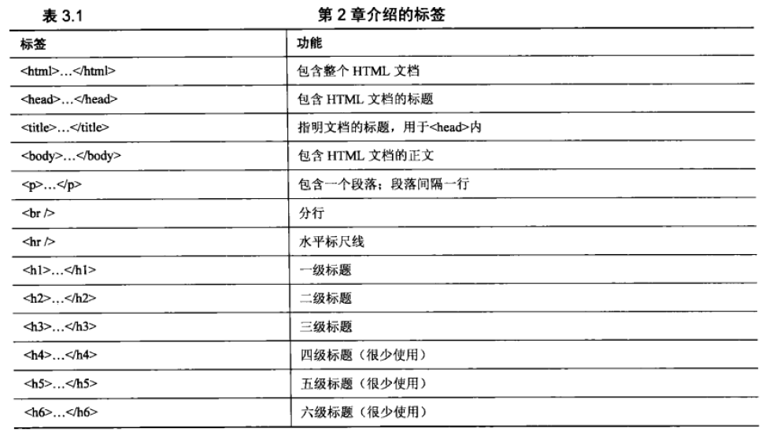
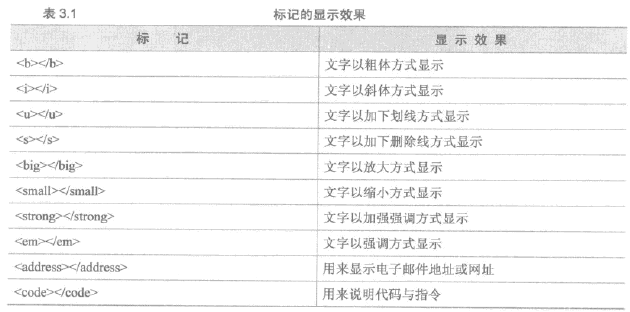

<!--
                 file : html.md
        creation date : 27-03-2017 19:31
           created by : Hubert Li
        last modified : Mon 03 Apr 2017 11:54:26 AM CST
            copyright : 2015-2019 by Hubert Li
                             Strictly Confidential
                             All rights reserved.
                       No part of this hardware description, either
                       material or conceptual may be copied or distributed,
                       transmitted, transcribed, stored in a retrieval system
                       or translated into any human or computer language in
                       any form by any means, electronic, mechanical, manual
                       or otherwise, or disclosed to third parties without
                       the express written permission of Hubert Li
-->


# 二、HTML
------------

## 1. HTML文件

### 基本概念
* HTML
   * 超文本标记语言
   * 描述性的标记语言
   * 用于描述超文本内容的显示方式
      * 定义标题/文本/表格等
      * 用HTML标记完成

### 组成
* HTML文件后缀
   * .htm
   * .html
* 0) 文档类型说明
   * 基本信息
      * 文档类型说明
      * 放在HTML页面开始，```<html>```标记之前
      * 放在```<!>```里
   * 包含信息
      * 规范版本
   * 作用
      * 告诉浏览器，按照哪种具体的规范来解释和显示这个页面
* 1) ```<html></html>```
   * 基本信息
      * 放在HTML文件的开头和结尾
      * 没有实质性功能，只是形式上标记
      * 标记HTML文件的开始和结束
* 2) ```<head></head>```
   * 基本信息
      * 头标记
      * 放在```<html></html>```标记里
      * 放置此HTML文件的信息
   * 包含信息
      * 提供索引
      * 定义CSS样式等
* 3) ```<title></title>```
   * 基本信息
      * 标题标记
      * 放在```<head></head>```标记里
      * 设定网页标题
         * 在浏览器左上方标题栏中显示
         * 在Windows任务栏中显示
* 4) ```<body></body>``` 
   * 基本信息
      * 主体标记
      * 放在```<html></html>```标记里,和头标记并行
      * 包含网页所显示的所有内容，是HTML文件的重点

## 2. HTML标记
* 最基本语法：<标记>内容</标记>
* 以"<"开始，以">"结束的单词，是命令编码，被称为HTML标签/标记

### 标记/标签分类
* 按功能分
   * 结构标记
      * 用于定义网页内容的结构
      * ```<p></p>```,```<table></table>```
   * 形式标记
      * 用于定义网页内容的形式
      * ```<b></b>```粗体,```<i></i>```斜体
* 按格式分
   * 开始标签
      * 指出HTML命令开始的一个HTML标签，命令影响的文本出现在开始标签之后
      * 以"<"开始，以">"结束
   * 结束标签
      * 指出HTML命令结束的一个HTML标签，命令影响的文本出现在结束标签之前
      * 以"</"开始，以">"结束
   * 空标签
      * 发出没有包含页面中的任何文本的HTML命令的标签
      * 以"<"开始，以"/>"结束
      * 如```<br/>,```


### 常用HTML标签
* 
* 换行和分段
   * ```<p></p>```,之后会有一个虚构的换行
   * ```<br/>```，在段落中强制一个换行
* ```<hr/>```
   * 空标签
   * 产生一条水平的标尺线

## 3. HTML属性
* 大多数HTML标记中都可以加入属性控制
* 属性的作用是帮助HTML标记进一步控制HTML文件的内容
   * 内容的对齐方式，文字的大小、字体、颜色、网页的背景样式，图片的插入等
* 基本语法：
```
   <标记名称 属性名1 = “属性值1” 属性名2 = “属性值2” .....>
```
   * 多个属性，之间用空格隔开
   * 有些属性，标记通用
   * 有些属性，是某些标记独有的

### 常用属性
* 1) align
   * 控制段落的水平位置
   * 值
      * center : 居中
      * right  : 向右对齐
      * left   : 向左对齐
* 2) bgcolor
   * 设置背景颜色
   * 只用于 body 标记
* 3) text
   * 设置文字颜色
   * 只用于 body 标记

## 4.文本

### 文本排版
* 显示
   * 网页浏览器 不会考虑行尾和文件间的空格和换行
      * 多个空格，会自动缩减成一个
      * 边缘会自动换行
* 段落和段内换行
   * 段落内行间距，小于段落间的间距
   * 可以通过CSS来设置间距
```
   段落标记：<p> </p>
   换行标记：<br/>
```
* 设置标题(```<h1>~<h6>```)
   * h1~h6, 6级大写标题,4,5,6级标题不常用，与3级显示区别不大
* 文字属性
   * 可以通过css设置
   * ```<font 属性=属性值></font>```设置
   * 水平居中```<center></center>```
* 文字段落的缩进
   * 发现，有```<p></p>```的功能
```
   <blockquote> </blockquote>
```

### 设置文字列表
* 作用
   * 有序地编排一些信息资源，使其结构化/条理化，并以列表的样式显示出来
* 分类
   * 项目列表，每个列项前有一个圆点符号
   * 序号列表，每个列项依次编号
* 无序列表
   * 标记  : ```<ul></ul>```
   * 列表项: ```<li></li>```
* 有序列表
   * 标记  : ```<ol></ol>```
   * 列表项: ```<li></li>```

### 设置文字的特殊样式
* 文字样式


### 设置文字的大小和属性 
* 标记 ```font```
   * 用于设置字体相关的属性
* 属性
   * face   ： 字体
   * size   ： 文字大小
   * color  ： 文字的颜色

## 5. 特殊文字符号
* ```&lt;``` 表示 < 号
* ```&gt;``` 表示 > 号
* ```&nbsp;``` 表示 空格
* ```&copy;``` 表示版权符号
* ```&divide;``` 表示除号
* ```&plusmn;``` 表示加减号
* ```&permil;``` 表示百分号
* ```&harr;``` 表示双向箭头
* ```<sup></sup>```,上标标记，用于将数字缩小后显示于上方
* ```<sub></sub>```,下标标记，用于将数字缩小后显示于下方

## 6.图片
* 图片标记
   * ``````
* src 属性
   * 值为图片的路径
      * 绝对路径或相对路径

### 图片格式
* gif
   * 图像交换格式
   * 只支持256色以内图片
   * 采用无损压缩存储
   * 支持透明色，可以使图像浮现在背景之上
*jpg
   * 静态图像压缩标准格式
   * 有损压缩方案
   * 1670万中颜色
* 选择
   * 颜色 不重要 GIF
   * GIF， 解码快，更多图像细节
   * jpg, 下载快，解码慢，图像边缘损失细节
* 图像保存
   * 照片类似图像，JPG
   * 线条构成，颜色较少，GIF

### 图片尺寸
* 用width height 属性设置
* 属性值，可以用整数或百分比表示
   * 整数，表示像素值
   * 百分比，相对于当前窗口大小的百分比

### 设置替换文本
* 用alt属性设置
* 当图像无法显示时，告诉浏览者该图片内容
* 新作用，用于搜索


## 7.超链接
* 标记
   * ```<a></a>```

### 文字超链接

```
   <a href = "目标地址"> 文本内容 </a>OB

```
* 两个要素
   * 超链接的文本内容
   * 超链接的目标地址
      * 属性 ```href```
      * 
      ```
      href = "URL"
      ```

### 页面内部的特定目标的链接
* 链接文字
   * 指明网页所应该调到那个目标名称的位置上
```
   <a href="#目标名称"> 链接文字 </a>
```
* 目标位置
   * 设置相应的跳转目标位置
   * 和链接文字中的跳转目标名称必须一致
```
   <a name ="目标名称">链接目标文字</a>
```

### 图片的超链接
* 格式
```
   <a href = "URL"> </a>
```

### 创建热点区域
* 图片的热点区域
   * 将一个图片划分出若干个链接区域
   * 访问者点击不同的区域会链接到不同的目标页面
* 格式
```
   
   <map name="map名称">
      <area shape="区域类型" coords="区域参数" href="URL">
   </map>
```
* 热点区域类型
   * 矩形 : rect
   * 圆形 : circle
   * 多边形: poly
* 区域参数
   * 区域的坐标是相对于热点区域所在的图片来设置的，而不是以浏览器窗口设置的
   * 矩形
      * 矩形的左、上、右、下四边的坐标，单位是像素
   * 圆形
      * 圆形的圆心左边(左上两点左边)，圆形的半径值(单位像素）
   * 多边形
      * 各点的坐标，单位为像素

### 电子邮件链接
* 格式
```
  <a href = "mailto:电子邮件地址">链接文字</a>
```

## 8.框架与框架集
* 标记
   * 框架 ```<frame>```
   * 框架集 ```<frameset> </frameset>```
* 注意
   * frameset 标记和body标记是同级的
   * 框架的作用是显示网页
* cols属性
   * 对窗口进行垂直分割
   * 语法
   ```
      <frameset cols ="n1,n2,...,*">
         <frame>
         <frame>
      </frameset>
   ```
      * ni, 表示子窗口i的宽度，单位是像素或者百分比
      * "*" 表示分配给前面所有窗口后剩下的宽度
   ```
* rows属性
   * 对窗口进行水平分割
   * 用法和cols属性一样
* 框架的嵌套
   * frameset 内部可再镶嵌frameset
* src属性
   * 用于在框架中插入网页
   * 语法
   ```
      <frame src="URL(HTML文件)">
   ```
* name属性
   * 用于给框架命名(frame标记)
   * 要实现跨框架的链接，就必须要对框架命名,以标识某个特定的框架
* target 属性
   * 指定目的框架
   * 目的框架用于显示链接的目标页面
   * 有4种值
      * _blank : 目的框架是新的浏览器窗口
      * _self  : 目的框架是原来的窗口，相当于不设置target属性
      * _top   : 框架可以层层嵌套，目的框架是顶级框架
      * _partent : 目的框架是"上一级"框架OB 

### 嵌入式/浮动框架
* 标记
   * ```<iframe></iframe>```
* 特性
   * 可以自由控制窗口的大小
   * 可以配合表格随意地在网页中的任何位置插入窗口
   * 实际上就是在窗口中再创建一个窗口
   * 浮动框架，不需要先创建框架集，直接使用即可
* 语法
```
   <iframe width= height= src="URL" name= ></iframe>  
```

## 9.表格
* 标记
   * ```<table></table>``` : 定义一个表格
   * ```<caption></caption>``` : 为表格添加标题
   * ```<thead></thead>``` : 表头
   * ```<tbody></tbody>``` : 主体
   * ```<tfoot></tfoot>``` : 脚注
   * ```<tr></tr>```       : 定义一行
   * ```<th></th>```       : 该单元格是一行的行头
      * 内容会以粗体显示
   * ```<td></td>          : 定义一个单元格
* 语法
```
   <table>
   <caption> 表格标题 </caption>
      <thead>           <!-- 表头 n 行 -->
         <tr>           <!-- 一行 -->            
            <td> A1 </td> <td> A2 </td> ...
         </tr>
         ...
      </thead> 
      <tbody>        <!-- 表格主体 n行 -->
         <tr>           <!-- 一行 -->            
            <td> A1 </td> <td> A2 </td> ...
         </tr>
         ...
      </tbody>
      <tfoot>        <!-- 表格脚注 n行 -->
         <tr>           <!-- 一行 -->            
            <td> A1 </td> <td> A2 </td> ...
         </tr>
         ...
      </tfoot>
   </table>
```

### 合并单元格
* colspan 属性
   * 合并左右单元格
   * 语法
      * num 标识几个单元格合并
   ```
      <td colspan = "num"> xxxx <td>
   ```
* rowspan 属性
   * 合并上下单元格
   * 语法
      * num1 标识几个单元格合并
      * num2 标识几行 * num1个单元格合并
   ```
      <td colspan="num1" rowspan="num2"> xxxx <td>
   ```

### 表格属性
* border : 线宽
* height : 行高
* width  : 行宽
* align  : 左右对齐
   * center
   * right
   * left
* valign : 上下对齐
   * top
   * middle (默认值)
   * bottom
* bgcolor : 表格背景色
* cellpadding
   * 设定表格单元格中，内容距离格线的距离
* cellspacing
   * 设定表格，相邻单元格边线的距离

### 行组
* 行组
   * 可以吧表格的行分组，称为行组
   * 行组分为3类
      * 表头
      * 主体
      * 脚注
* 用途
   * 表现形式没有区别
   * 方便CSS按照结构进行表格样式设定


