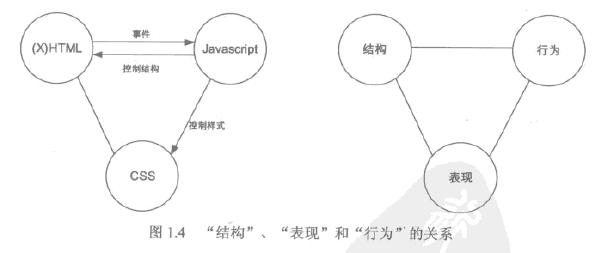
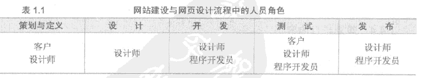
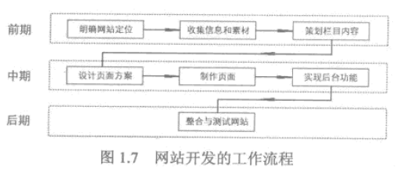

<!--
                 file : webpage.md
        creation date : 27-03-2017 19:31
           created by : Hubert Li
        last modified : Mon 03 Apr 2017 11:56:41 AM CST
            copyright : 2015-2019 by Hubert Li
                             Strictly Confidential
                             All rights reserved.
                       No part of this hardware description, either
                       material or conceptual may be copied or distributed,
                       transmitted, transcribed, stored in a retrieval system
                       or translated into any human or computer language in
                       any form by any means, electronic, mechanical, manual
                       or otherwise, or disclosed to third parties without
                       the express written permission of Hubert Li
-->

# 一、基本概念
--------------

## 1.常用词汇
* 万维网/互联网
   * www可以认为时互联网所提供的很多功能中的一个，指通过浏览器访问各种网站的功能
* Web page
   * 我们常说的网页
   * 包含网页文本/图像/音频/视频和其他在线媒体
* 网页文件
   * 用HTML标记语言书写的文本文件
   * 也被称为HTML文件
* HTML
   * 超文本标记语言
      * 描述文本/图形/包含其他信息的文件组织和链接在一起的一种语言
* Web托管提供商
   * 价格
   * 域名购买和管理
   * 该款
   * 服务器空间
   * 客户服务
   * 可靠性/服务器“正常运行时间”
* 浏览器
   * Apple Safari
   * Google Chrome
   * Mozilla Firefox
   * Microsoft Internet Explorer
   * Opera
* 常见文件和后缀
```
   ---------------------------------------------
      文件                          后缀
   ---------------------------------------------
      HTML网页                      .htm/.html
   ---------------------------------------------
      Java 服务器页面               .jsp
   ---------------------------------------------
      Microsoft 活动服务器页面      .asp
   ---------------------------------------------
      PHP超文本预处理器             .php
   ---------------------------------------------
```
* web验证工具
   * 万维网联盟(负责开发Web标准的组织)，W3C提供了一个在线验证工具
      * [URL](http://validator.w3.org)

## 2. Web标准
* 网页由3部分组成：结构、表现、行为

   * 结构决定了网页时什么
   * 表现决定了网页看起来时什么样子
   * 行为决定了网页做什么
   * 对应3中技术
      * (X)HTML,决定网页的结构和内容
      * CSS，决定网页的表现样式
      * JavaScript,用来控制网页的行为
* 结构
   * 各级标题、正文段落、各种列表结构
* 表现
   * 字号、字体和颜色等属性
* 行为
   * 网页时随时可以变化的，可以和读者互动，如何变化及如何交互就是它的行为

## 3. 网页设计开发过程
* 大致分为5个阶段
   * 策划与定义
   * 设计
   * 开发
   * 测试
   * 发布
* 基本任务与角色

   * 客户提出需求提供在网站中呈现的具体内容
   * 设计师进行页面世界，并构建网站
   * 程序开发员为网站添加动态功能

### 开发流程

* 网站定位
   * 目的
   * 客户需求
   * 探讨
* 收集信息和素材
   * 信息和功能
   * 计划书
* 策划栏目内容
   * 找出重点
   * 结合网站定位，确定栏目
   * 大型网站，确定二级栏目下的子栏目
   * 确定每个二级栏目的主页内容
   * 确定每个子栏目的内容
   * 栏目负责人写栏目计划书
* 设计页面方案
   * 美工，根据每个栏目的策划书来设计页面
* 制作页面
   * 静态页面
   * 动态页面
* 实现后台功能
   * 实现动态功能
* 整合和测试网站

## 4. 设计相关技术因素
   
### 屏幕显示分辨率
* 显示器在显示图像时的分辨率，通常用像素来衡量
* 形式：水平像素数量 x 垂直像素数量

### 浏览器类型
* 对HTML的标准支持不同
* 对CSS标准支持不同

## 5.HTML标准

### HTML与XHTML
* XHTML 是更加结构化的HTML版本
* Web标准
   * XHTML1.1
   * HTML5


# 二、HTML
------------
[html.md](./html.md)


# 三、css
------------
[css.md](./css.md)


# Appendiex A
---------------

## documents related
* [[HTML.CSS网页设计与布局从入门到精通].温谦](../doc/[HTML.CSS网页设计与布局从入门到精通].温谦.pdf)
* [CSS完整参考](http://www.w3.org/Style/CSS/)
* [主要浏览器支持CSS方面差别](http://www.westciv.com/style_master/academy/browser_support/)
