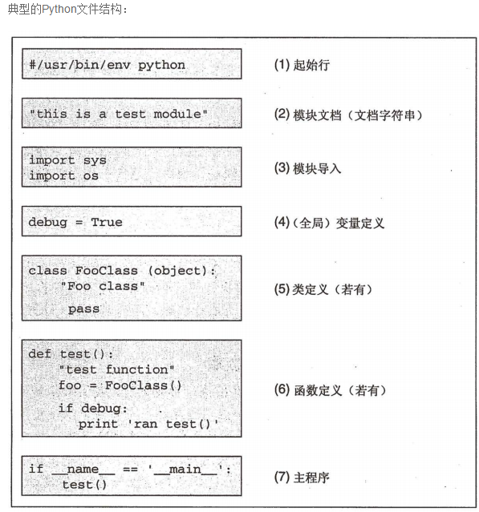

-- ------------------------------------------------------------------------------------
--                 file : python.md
--        creation date : 18-03-2017 13:55
--           created by : Hubert Li
--        last modified : Fri 21 Apr 2017 05:22:57 PM HKT
--            copyright : 2015-2019 by Hubert Li
--                             Strictly Confidential
--                             All rights reserved.
--                       No part of this hardware description, either
--                       material or conceptual may be copied or distributed,
--                       transmitted, transcribed, stored in a retrieval system
--                       or translated into any human or computer language in
--                       any form by any means, electronic, mechanical, manual
--                       or otherwise, or disclosed to third parties without
--                       the express written permission of Hubert Li
-- ------------------------------------------------------------------------------------


# Chapter 1 python 基本概念
--------------------

* 什么是python
    * python其实就是一门脚本语言，什么是 脚本语言呢，其实就是可以通过文本文档就可以编辑的就是脚本语言。因为具有丰富和强大的库。它常被昵称为 ”胶水语言“

## 1.程序执行入口
--------------------
* python 没有main函数
* 从下面代码***后面***的语句开始执行 
``` 
    if __name__=="__main__": 
```

## 2. python 的包、模块、类
* 在编写Python代码时，我们需要管理代码的文件目录结构
    * 由于Python一个文件算一个模块，一个带__init__.py的目录算一个包。 
    * 而为了控制代码文件不要过大，我们需要的是一个类（几个类或加些许函数）分配一个文件。

### 1.python模块

* 每个python文件 就是一个python 模块
    * 扩展名可以是py、pyc、pyd
* _name_
    * 每一个模块都有一个默认的属性__name__。
    * __name__ 的值：
        * 1、直接运行一个python的程序的时候，如python test.py, 则__name__ 的值是 __main__。
        * 2、一个python模块被import的时候，则__name__的值为模块的文件名（不带路径及文件扩展名）。
        * __name__值的使用：用于处理初始化
        ```
            #!/usr/bin/python 
            # Filename: mtest.py 
   
            if __name__ == '__main__':
                print '模块正被直接运行，可做一些初始化的操作'
            else:
                print '模块正被其他python程序import，可做一些初始化的操作'
        ```

### 2.python包
* 包（Package）可以看成模块的集合
    * 只要一个文件夹下面有个__init__.py文件，那么这个文件夹就可以看做是一个包。
    * 包下面的文件夹还可以成为包（子包）。
    * 更进一步，多个较小的包可以聚合成一个较大的包，
    * 通过包这种结构，方便了类的管理和维护，也方便了用户的使用。比如SQLAlchemy等都是以包的形式发布给用户的
* 包的导入
    * 导入的过程和模块的基本一致，只是导入包的时候会执行此包目录下的__init__.py而不是模块里面的语句了
    * 如果只是单纯的导入包，而包的__init__.py中又没有明确的其他初始化操作，那么此包下面的模块是不会自动导入的


# Chapter 2 语法
--------------------

## 1.基本语法
--------------------

### 缩进
* Python开发者有意让违反了缩进规则的程序不能通过编译，以此来强制程序员养成良好的编程习惯。
* 并且Python语言利用缩进表示语句块的开始和退出（Off-side规则），而非使用花括号或者某种关键字。
* 增加缩进表示语句块的开始，而减少缩进则表示语句块的退出。缩进成为了语法的一部分。
* 根据PEP的规定，必须使用4个空格来表示每级缩进（不清楚4个空格的规定如何，在实际编写中可以自定义空格数，但是要满足每级缩进间空格数相等）。
  * 使用Tab字符和其它数目的空格虽然都可以编译通过，但不符合编码规范。
  * 支持Tab字符和其它数目的空格仅仅是为兼容很旧的的Python程序和某些有问题的编辑程序。

### 控制语句
* if语句
    * 当条件成立时运行语句块。
    * 经常与else, elif(相当于else if) 配合使用。
    * y if cond else x表示条件表达式。
        * 意思是当cond为真时，表达式的值为y，否则表达式的值为x。
        * 相当于C++和Java里的cond?y:x。
* for语句，遍历列表、字符串、字典、集合等迭代器，依次处理迭代器中的每个元素。
* while语句，当条件为真时，循环运行语句块。
* try语句。与except,finally配合使用处理在程序运行中出现的异常情况。
* class语句。用于定义类型。
* def语句。用于定义函数和类型的方法。
* pass语句。表示此行为空，不运行任何操作。
* assert语句。用于程序调试阶段时测试运行条件是否满足。
* with语句。Python2.6以后定义的语法，在一个场景中运行语句块。比如，运行语句块前加密，然后在语句块运行退出后解密。
* yield语句。在迭代器函数内使用，用于返回一个元素。自从Python 2.5版本以后。这个语句变成一个运算符。
* raise语句。制造一个错误。

### import语句。
* 导入一个模块或包。
* import只能导入模块，不能导入模块中的对象（类、函数、变量等）
* 可以通过import来导入多个模块，用“,”（逗号）分隔

#### from ... import ... 语句。
* 从包导入模块或从模块导入某个对象。
    * 模块其实就一些函数和类的集合文件，类似于C语言中的include头文件
* 搜索路径 
    * 顺序
        * 在当前目录下搜索该模块
        * 在环境变量PYTHONPATH中指定的路径列表中依次搜索；
            * 需要自己设置
        * 在Python安装路径中搜索
    * 搜索路径都放在了sys.path列表中
        * sys.path第一个路径往往是主模块所在的目录。在交互环境下添加一个空项，它对应当前目录。
        * 如果PYTHONPATH环境变量存在，sys.path会加载此变量指定的目录。
            * 需要自己设置
    * 添加搜索路径
        * sys.path.append(路径)
        * 绝对路径
        * 相对路径

* import as语句。将导入的对象赋值给一个变量。
* in语句。判断一个对象是否在一个字符串/列表/元组里。

### 表达式
* 算术运算符
    * 与C/C++类似。
    * +, -, *, /, //, **, ~, %分别表示加法或者取正、减法或者取负、乘法、除法、整除、乘方、取补、取模
* >>, <<表示右移和左移。
* &, |, ^表示二进制的AND, OR, XOR运算。
* >, <, ==, !=, <=, >=用于比较两个表达式的值，分别表示大于、小于、等于、不等于、小于等于、大于等于。
* 在这些运算符里面，~, |, ^, &, <<, >>必须应用于整数。
* and, or, not表示逻辑运算。
* is, is not用于比较两个变量是否是同一个对象。
* in, not in用于判断一个对象是否属于另外一个对象。
* Python支持“列表推导式”（list comprehension），
    * 比如计算0-9的平方和:
    ```
    python
    >>> sum(x * x for x in range(10))
    28
    ```
* Python使用lambda表示匿名函数。匿名函数体只能是表达式。
    * 比如：
    ```
    python
    >>> add=lambda x, y : x + y
    >>> add(3,2)
    5
    ```
* Python区分列表(list)和元组(tuple)两种类型。
    * list的写法是[1,2,3]，而tuple的写法是(1,2,3)
    * 可以改变list中的元素，而不能改变tuple。
    * 在某些情况下，tuple的括号可以省略。
    * tuple对于赋值语句有特殊的处理。因此，可以同时赋值给多个变量，
        * 比如：
        ```
        >>> x, y=1,2#同时给x,y赋值，最终结果：x=1, y=2
        特别地，可以使用以下这种形式来交换两个变量的值：
        >>> x, y=y, x #最终结果：y=1, x=2
        ```
* Python使用'(单引号)和"(双引号)来表示字符串。
    * 两种符号作用相同。与Perl、Unix Shell语言或者Ruby、Groovy等语言不一样
    * 一般地，如果字符串中出现了双引号，就使用单引号来表示字符串;反之则使用双引号。
    * 出现在字符串中的\(反斜杠)被解释为特殊字符，比如\n表示换行符。
    * 表达式前加r指示Python不解释字符串中出现的\。这种写法通常用于编写正则表达式或者Windows文件路径。
* Python支持列表切割(list slices)，可以取得完整列表的一部分。
    * 支持切割操作的类型有str, bytes, list, tuple等。
    * 它的语法是...[left:right]或者...[left:right:stride]。
    * 假定nums变量的值是[1, 3, 5, 7, 8, 13, 20]，那么下面几个语句为真：
    ```
        nums[2:5] == [5, 7, 8] 从下标为2的元素切割到下标为5的元素，但不包含下标为2的元素。
        nums[1:] == [3, 5, 7, 8, 13, 20] 切割到最后一个元素。
        nums[:-3] == [1, 3, 5, 7] 从最开始的元素一直切割到倒数第3个元素。
        nums[:] == [1, 3, 5, 7, 8, 13, 20] 返回所有元素。改变新的列表不会影响到nums。
        nums[1:5:2] == [3, 7] 从下标为1的元素切割到下标为5的元素但不包含下标为5的元素，且步长为2。
    ```

### 函数
* Python的函数支持递归、默认参数值、可变参数，但不支持函数重载。
    * 为了增强代码的可读性，可以在函数后书写“文档字符串”(Documentation Strings，或者简称docstrings)，用于解释函数的作用、参数的类型与意义、返回值类型与取值范围等。
    * 可以使用内置函数help()打印出函数的使用帮助
    ```
        >>> def randint(a, b):
        ... "Return random integer in range [a, b], including both end points."...
        >>> help(randint)
        Help on function randint in module __main__:
        randint(a, b)
        Return random integer inrange[a, b], including both end points.
    ```

# Chapter 3 常用包/模块
-----------------------

## urllib 模块 

# Chapter 4 应用
----------------

* 系统编程：提供API（Application Programming Interface应用程序编程接口），能方便进行系统维护和管理，Linux下标志性语言之一，是很多系统管理员理想的编程工具[7]  。
* 图形处理：有PIL、Tkinter等图形库支持，能方便进行图形处理。
* 数学处理：NumPy扩展提供大量与许多标准数学库的接口。
* 文本处理：python提供的re模块能支持正则表达式，还提供SGML，XML分析模块，许多程序员利用python进行XML程序的开发。
* 数据库编程：程序员可通过遵循Python DB-API（数据库应用程序编程接口）规范的模块与Microsoft SQL Server，Oracle，Sybase，DB2，MySQL、SQLite等数据库通信。
    * python自带有一个Gadfly模块，提供了一个完整的SQL环境。
* 网络编程：提供丰富的模块支持sockets编程，能方便快速地开发分布式应用程序。很多大规模软件开发计划例如Zope，Mnet 及BitTorrent. Google都在广泛地使用它。
* Web编程：应用的开发语言，支持最新的XML技术。
* 多媒体应用：Python的PyOpenGL模块封装了“OpenGL应用程序编程接口”，能进行二维和三维图像处理。PyGame模块可用于编写游戏软件。
* pymo引擎：PYMO全称为python memories off，是一款运行于Symbian S60V3,Symbian3,S60V5, Symbian3, Android系统上的AVG游戏引擎。
  * 因其基于python2.0平台开发，并且适用于创建秋之回忆（memories off）风格的AVG游戏，故命名为PYMO。
* 黑客编程：python有一个hack的库,内置了你熟悉的或不熟悉的函数，但是缺少成就感。

## 著名应用
* Pylons-Web应用框架
* Pylons-Web应用框架
* Pylons-Web应用框架
* Zope- 应用服务器
* Plone- 内容管理系统
* Django- 鼓励快速开发的Web应用框架
* Uliweb- 国人开发的轻量级Web框架
* TurboGears- 另一个Web应用快速开发框架
* * Twisted--Python的网络应用程序框架
* Python Wikipedia Robot Framework- MediaWiki的机器人程序
* MoinMoinWiki- Python写成的Wiki程序
* flask- Python 微Web框架
* tornado- 非阻塞式服务器
* Webpy- Python 微Web框架
* Bottle- Python 微Web框架
* EVE- 网络游戏EVE大量使用Python进行开发
* Reddit - 社交分享网站
* Dropbox - 文件分享服务
* Pylons - Web应用框架
* TurboGears - 另一个Web应用快速开发框架
* Fabric - 用于管理成百上千台Linux主机的程序库
* Trac - 使用Python编写的BUG管理系统
* Mailman - 使用Python编写的邮件列表软件
* Mezzanine - 基于Django编写的内容管理系统
* Blender - 以C与Python开发的开源3D绘图软件


# Appendix A
----------------

## 学习网站
----------------

* Python官方文档[9] 
* PythonTab中文网
* Python爱好者论坛[10] 
* Pythoner在线互动交流平台
* [python菜鸟教程](http://www.runoob.com/python/python-tutorial.html) 
* python基础教程[11-12] 
* Python教程 - 廖雪峰[12] 
* python 网络教育-百度传课[13]
